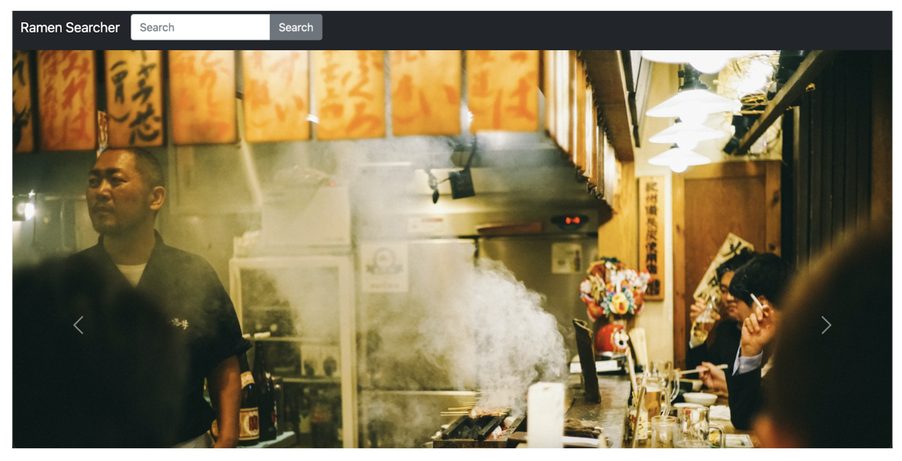
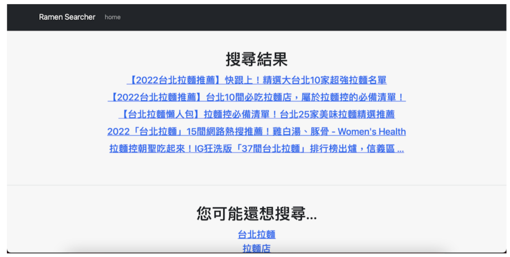
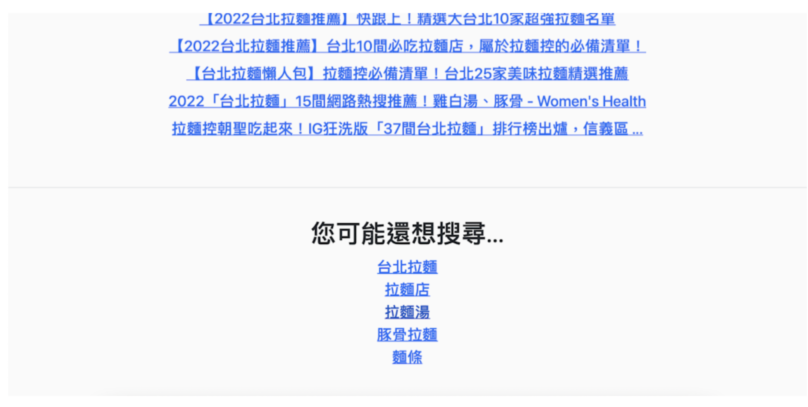
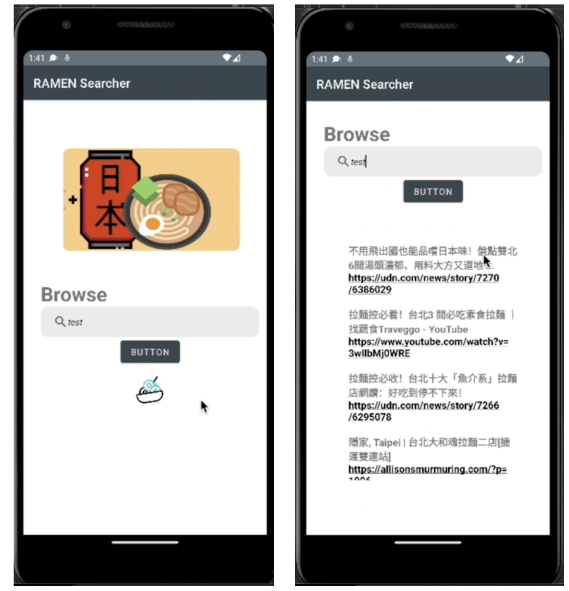
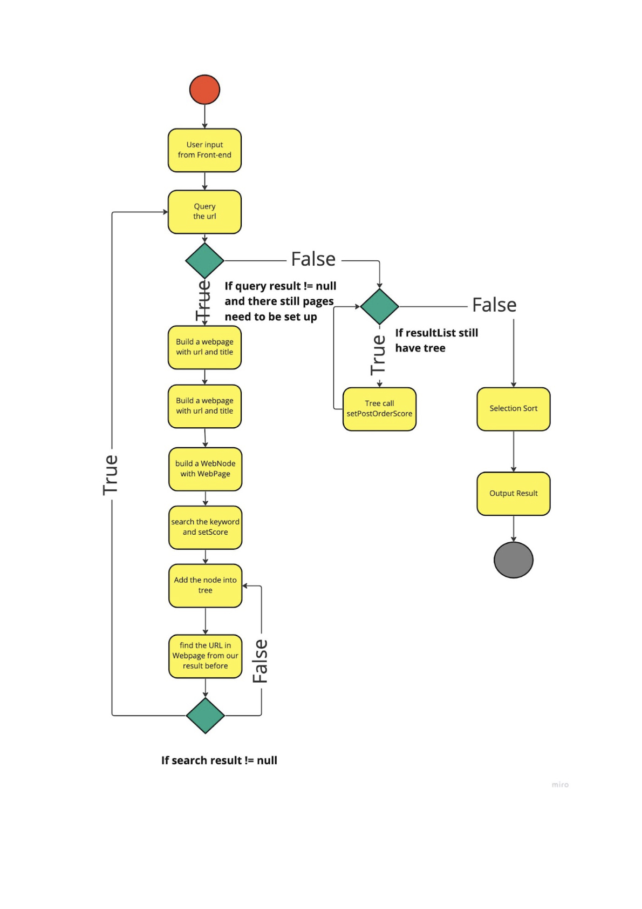

# RamenSearcher

## 1. Introduction

## 2. System Introduction:
The search results are based on goole search result. To improve the search result, we make an formula to recaculate the page rank based on how many keywords appear in a webpage and their subpages. Each website in a search result are considered a tree structure. By web crawling every website (every tree), We can get a new rank list and it is how we generate a better search result related to Ramen.

## 3. System Design:

